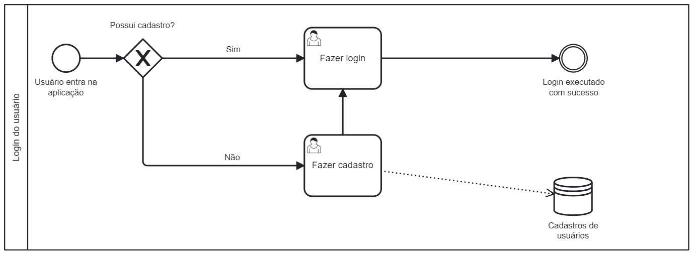
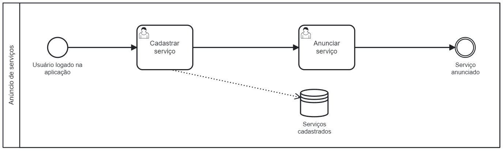

# Especificações do Projeto

A definição exata do problema e os pontos mais relevantes a serem tratados neste projeto foram consolidados com a participação dos usuários em um trabalho de imersão feita pelos membros da equipe a partir da observação dos usuários em seu local natural e por meio de entrevistas. Os detalhes levantados nesse processo foram afirmados na forma de personas e histórias de usuários

## Personas

Seguem demonstradas por meio dos quadros apresentados o levantamento feito das personas e suas características durante o processo de entendimento do problema:

|    Persona    | Idade |           Ocupação           |                        Aplicativos                       |                      Motivações                     |                           Frustrações                          |                           Hobbies                          |
|:-------------:|:-----:|:---------------------------:|:--------------------------------------------------------:|:--------------------------------------------------:|:----------------------------------------------------------------:|:---------------------------------------------------------:|
| Daniel Santos  |   41  | Segurança de empresa privada | WhatsApp, Instagram, LinkedIn, Aplicativos de bancos    | Trabalhar visando proporcionar uma boa qualidade de vida para a família. | Não conseguir entregar uma obra dentro do prazo. | Gosta de ler, Ouvir música |
| Gabriel Gamber  |   22  |     Técnico em Informática   | WhatsApp, Instagram, Twitch, Youtube, Discord           | Entregar ao cliente o resultado que ele mesmo gostaria de receber. | Sentir que seu trabalho não está sendo bem feito. | Assistir séries, jogar jogos online |
| Ricardo Ornelas  | 39 |         Film Maker          | WhatsApp, Facebook, Instagram                           | Procura de staff qualificada para apoio em seus projetos. | Falta de oportunidades para iniciar sua carreira. | Aprimorar o conhecimento em sua área de atuação. |
| Heloísa Pimenta  |   25  | Cuidadora de Idosos, acompanhante hospitalar e estudante de Enfermagem | WhatsApp, Instagram, TikTok, Youtube | Crescer como profissional da saúde. | Sentir que seu trabalho não está sendo bem feito. | Praticar exercícios físicos, ler. |
|    Maria Gomes  |   24  |   Designer de interiores e empresaria   | WhatsApp, Instagram, TikTok                            | Crescer sua empresa e maximizar seus lucros.      | Falta de resultados expressivos na busca de mão de obra qualificada. | Academia, Maquiagem. |

> - [Imagens das personas retiradas deste site](https://br.freepik.com/)

## Histórias de Usuários

Com base na análise das personas forma identificadas as seguintes histórias de usuários:

|EU COMO... `PERSONA`| QUERO/PRECISO ... `FUNCIONALIDADE`         |PARA ... `MOTIVO/VALOR`                               |
|--------------------|--------------------------------------------|------------------------------------------------------|
|Daniel Santos         |Encontrar clientes de forma rápida e objetiva                        |Prestar seus serviços com mais tranquilidade afim de complementar sua renda       |
|Ricardo Ornelas      |Estabelecer conexões com outros profissionais afim de trocar ideias sobre a execução dos serviços                           |Encontrar procedimentos visando otimizar o tempo total de uma obra|
|Gabriel Gamber        |Encontrar pessoas e estabelecimentos que buscam serviços de qualidade        |Ampliar suas experiências e obter mais resultados satisfatórios  |
|Heloísa Pimenta       |Sentir satisfação ao ver pessoas que passaram sob seus cuidados recuperadas e com qualidade de vida           |Retribuição moral e pessoal
|Maria Gomes        |Localizar mais pessoas necessitadas de cuidados específicos e atenção hospitalar          |Ajudar mais pessoas, obter mais experiências e contatos                  |

## Modelagem do Processo de Negócio 

### Análise da Situação Atual

Nos últimos anos, o Brasil tem observado um aumento significativo no número de trabalhadores autônomos. Esse crescimento pode ser explicado por diversos fatores, como a crise econômica que afetou o país, o aumento do desemprego e a busca por maior flexibilidade no trabalho. Com a facilidade de acesso à tecnologia e às redes sociais, muitos brasileiros têm optado por empreender e trabalhar por conta própria, buscando alternativas para garantir sua renda e independência financeira. 
Atualmente, existem diversas tecnologias que facilitam a busca e oferta de serviços autônomos. Plataformas online como Workana, 99Freelas e GetNinjas permitem que profissionais ofereçam seus serviços de maneira fácil e acessível, conectando-os com clientes em busca de soluções específicas. Além disso, aplicativos como Uber e iFood possibilitam que pessoas realizem trabalhos temporários de motorista ou entregador, respectivamente. As redes sociais também se tornaram um meio popular de divulgação de serviços, permitindo que autônomos alcancem um público maior e construam sua reputação online.

### Descrição Geral da Proposta

A proposta é criar um ambiente virtual em que seja intuitivo qualquer pessoa com um smartphone ofertar um produto ou um serviço e ser remunerado por isto. A diferença dessa plataforma (JOBS.) para as outras seriam a facilidade de uso dentro do sistema, com informações diretas e simples, sem a poluição visual presente nos outros sistemas. A ideia é a criação de uma plataforma em aplicativo de celular que seja fácil e rápido de usar, ligando o fornecedor ao contratante com poucos cliques.

### Oportunidades de melhoria para o processo de negócio
Os aplicativos de smartphones se tornaram extremamente populares nos últimos anos, devido à facilidade de uso e acessibilidade. Com apenas alguns toques na tela do celular, é possível baixar e utilizar uma grande variedade de aplicativos para diversas finalidades, como comunicação, entretenimento, finanças e trabalho. Além disso, muitos aplicativos oferecem interfaces intuitivas e simples, o que facilita o uso mesmo para pessoas sem experiência em tecnologia. Com essa facilidade, os aplicativos se tornaram parte essencial do cotidiano de muitas pessoas, tornando a vida mais prática e conveniente. 
Os aplicativos de procura e oferta de serviços existentes possuem muita informação, filtros desnecessários e poluição visual com ofertas patrocinadas e propagandas geradas por cookies relacionados ao cliente. Os aplicativos deixam de ser intuitivos e práticos, demando maior tempo das pessoas nesses para poderem aprender a utilizar a plataforma. A JOBS. veio com o intuito de democratizar esse tipo de plataforma gerando facilidade e comodidade aos seus clientes, permitindo que de maneira limpa e intuitiva, os objetivos de oferta e busca de serviço estejam a poucos cliques.

### Processo 1 – LOGIN DO USUÁRIO

### Processo 2 – GERENCIAMENTO DO PERFIL

### Processo 3 – ANÚNCIO DE SERVIÇOS

### Processo 4 – SOLICITAÇÃO DO CONTRATANTE

### Processo 5 - SOLICITAÇÃO DE SERVIÇO

## Indicadores de Desempenho

Apresente aqui os principais indicadores de desempenho e algumas metas para o processo.

## Requisitos

As tabelas que se seguem apresentam os requisitos funcionais e não funcionais que detalham o escopo do projeto. Para determinar a prioridade de requisitos, foi aplicada a técnica de priorização da Escala de Três Níveis, que busca delimitar o universo de possíveis valores desse atributo para tais possibilidades, de modo que a prioridade seja uniformizada e melhor entendida por todos do time.

Foram estabelecidos os níveis de prioridade de acordo com os dois aspectos principais: importância e urgência. Assim, forma-se um quadrante, capaz de criar prioridades que combinem esses aspectos.

### Requisitos Funcionais

|ID    | Descrição do Requisito  | Prioridade |
|------|-----------------------------------------|----|
|RF-001| O usuário deve conseguir cadastrar uma conta na aplicação móvel. | ALTA | 
|RF-002| O usuário cadastrado deve conseguir fazer o login em sua conta.   | ALTA |
|RF-003| O usuário deve conseguir editar informações do seu perfil.   | MÉDIA |
|RF-004| O anunciante deve conseguir publicar serviços na aplicação móvel.   | ALTA |
|RF-005| O anunciante deve conseguir informar valores do seu serviço.  | ALTA |
|RF-006| O usuário deve conseguir buscar por serviços na aplicação.   | ALTA |
|RF-007| O usuário deve conseguir buscar por serviços vinculados a um determinado anunciante.   | MÉDIA |
|RF-008| O anunciante deve conseguir decidir o meio de comunicação com o usuário referente ao serviço publicado. 	   | ALTA |
|RF-009| O anunciante deve conseguir contratar serviço.	   | ALTA |
|RF-010| A aplicação móvel deve notificar o anunciante sobre a solicitação de serviço.  | MÉDIA |
|RF-011| O Anunciante deve conseguir rejeitar um serviço caso não queira executa-lo.  | ALTA |
|RF-012| O Usuário deve conseguir avaliar e comentar nos serviços contratados da aplicação.  | BAIXA |
|RF-013| O usuário deve conseguir ver as avaliações e comentários de clientes nos serviços.  | BAIXA |
|RF-014| A aplicação móvel deve conter uma tela principal  | ALTA |
|RF-015| A aplicação móvel deve conter tela de login  | ALTA |

### Requisitos não Funcionais
Os requisitos não funcionais não estão relacionados diretamente com os serviços específicos do sistema oferecidos aos seus usuários. Eles estão relacionados com o nível de serviço esperado para o melhor funcionamento do software como um todo. O descritivo abaixo representa o escopo não funcional que a plataforma atenderá:

|ID     | Descrição do Requisito  |Prioridade |
|-------|-------------------------|----|
|RNF-001|A aplicação deve retornar os resultados da busca de serviços em até 5 segundos.  | ALTA | 
|RNF-002|A aplicação deve verificar a disponibilidade do serviço requisitado pelo usuário antes de notificar o anunciante.   |  ALTA | 
|RNF-03|A aplicação deve ter ícones representando visualmente as funcionalidades.  | MÉDIA | 

## Restrições

As questões que limitam a execução desse projeto e que se configuram como obrigações claras para o desenvolvimento do projeto em questão são apresentadas na tabela a seguir.

|ID| Restrição                                             |
|--|-------------------------------------------------------|
|RE-01|A aplicação móvel deve ser feita apenas por membros do grupo do projeto.  |
|RE-02|A aplicação móvel deve ser desenvolvida apenas utilizando React Native |
|RE-03|O sistema deve ser responsivo |

## Diagrama de Casos de Uso

O diagrama de casos de uso é o próximo passo após a elicitação de requisitos, que utiliza um modelo gráfico e uma tabela com as descrições sucintas dos casos de uso e dos atores. Ele contempla a fronteira do sistema e o detalhamento dos requisitos funcionais com a indicação dos atores, casos de uso e seus relacionamentos. 

# Matriz de Rastreabilidade

A matriz de rastreabilidade é uma ferramenta usada para facilitar a visualização dos relacionamento entre requisitos e outros artefatos ou objetos, permitindo a rastreabilidade entre os requisitos e os objetivos de negócio. 

# Gerenciamento de Projeto

De acordo com o PMBoK v6 as dez áreas que constituem os pilares para gerenciar projetos, e que caracterizam a multidisciplinaridade envolvida, são: Integração, Escopo, Cronograma (Tempo), Custos, Qualidade, Recursos, Comunicações, Riscos, Aquisições, Partes Interessadas. Para desenvolver projetos um profissional deve se preocupar em gerenciar todas essas dez áreas. Elas se complementam e se relacionam, de tal forma que não se deve apenas examinar uma área de forma estanque. É preciso considerar, por exemplo, que as áreas de Escopo, Cronograma e Custos estão muito relacionadas. Assim, se eu amplio o escopo de um projeto eu posso afetar seu cronograma e seus custos.

## Gerenciamento de Tempo

Com diagramas bem organizados que permitem gerenciar o tempo nos projetos, o gerente de projetos agenda e coordena tarefas dentro de um projeto para estimar o tempo necessário de conclusão.

O gráfico abaixo é uma ferramenta utilizada para controlar e gerenciar o cronograma de atividades de um projeto. Com ele, é possível listar tudo que precisa ser feito para colocar o projeto em prática, dividir em atividades e estimar o tempo necessário para executá-las.

## Gerenciamento de Equipe

O gerenciamento adequado de tarefas contribuirá para que o projeto alcance altos níveis de produtividade. Por isso, é fundamental que ocorra a gestão de tarefas e de pessoas, de modo que os times envolvidos no projeto possam ser facilmente gerenciados. 

## Gestão de Orçamento

O processo de determinar o orçamento do projeto é uma tarefa que depende, além dos produtos (saídas) dos processos anteriores do gerenciamento de custos, também de produtos oferecidos por outros processos de gerenciamento, como o escopo e o tempo.

